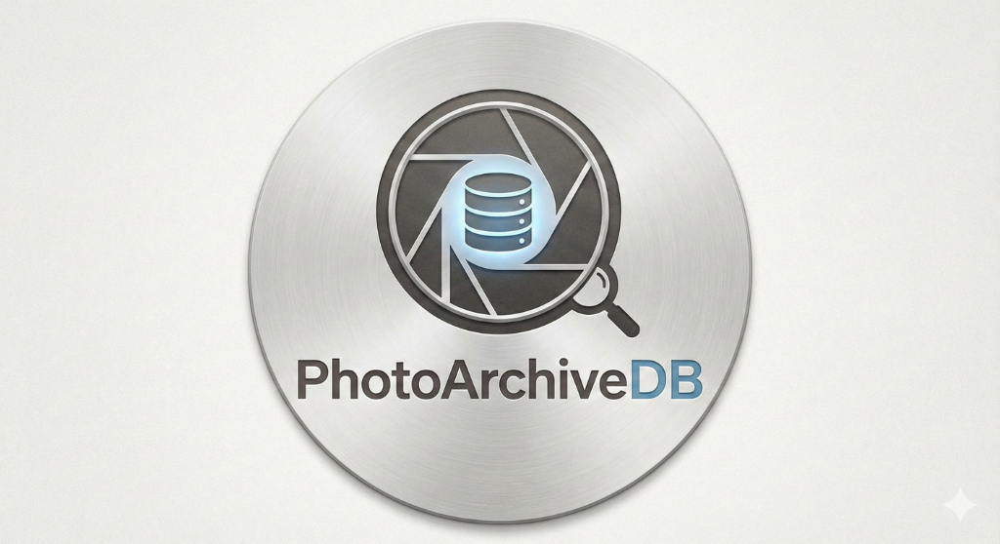

#  PhotoArchiveDB: Your History, De-Siloed.

**PhotoArchiveDB** is a robust, self-hosted Digital Asset Management (DAM) system built for archivists and photographers who want full control over their data. It treats your local file system as the source of truth, enriching it with a powerful SQLite database for search, organization, and analysis—without locking your files into a proprietary "black box."

## Key Features

*   **Files First**: Your photos stay in your folders. We monitor them, index them, and visualize them, but we never hide them.
*   **Deep Metadata**: Uses **ExifTool** to extract extensive metadata (GPS, Camera, Lens, Captions, Keywords) from every file.
*   **Self-Healing Library**: Automatically detects moved files (via SHA256 hashing) and updates the database, preserving your tags and faces even if you reorganize your hard drive.
*   **GPS Integration**: View photo locations directly on Google Maps.
*   **Local Face Recognition (Beta)**: Detect and cluster faces privately on your own device.
*   **Scoped Search**: Context-aware search lets you drill down into specific folders or search the entire library instantly.
*   **Two-Way Metadata Sync**: Edit titles, captions, and ratings directly in the app. Changes are written back to your original files (Embedded for JPG, Sidecar for RAW) with a "Safety First" automated backup system.

---

## 🚀 Installation & Setup

### 🤖 Antigravity Quick Start
If you are using Google's Antigravity AI, you can automate the entire setup:
1.  **Create a new Workspace**.
2.  **Paste this prompt** into the chat:
    ```text
    Clone functionality from https://github.com/josephaschmoe/PhotoArchiveDB.git.
    Setup a python environment, install dependencies from requirements.txt.
    Run the application.
    ```
3.  The agent will set up the environment and start the server for you.

---

### Manual Setup
If you are setting this up manually:

### Prerequisites
*   **Python 3.8+**
*   **ExifTool**: Must be installed and available in your system PATH.
    *   [Download ExifTool](https://exiftool.org/)
*   **(Optional) C++ Build Tools**: Required if you want to enable Face Recognition (dlib).

### 1. Download the Code
Clone the repository:
```bash
git clone https://github.com/josephaschmoe/PhotoArchiveDB.git
cd PhotoArchiveDB
```

### 2. Create a Virtual Environment
It is recommended to run ArchiveDB in a clean environment.
```bash
# Windows
python -m venv venv
.\venv\Scripts\activate

# Mac/Linux
python3 -m venv venv
source venv/bin/activate
```

### 3. Install Dependencies
```bash
pip install -r requirements.txt
```

### 4. Initialize Configuration
The application runs out-of-the-box with default settings (using a local `app.db` SQLite database). You can customize `config.py` if needed.

### 5. Run the Server
```bash
python run.py
```
Open your browser to `http://127.0.0.1:5000`.

---

## 📖 User Guide

### 1. Building Your Library
*   Navigate to the **Scan** tab.
*   **Add a Folder**: You can type the path manually or use the **"Browse..."** button to open a system dialog and select your photo folder.
*   Click **Add Path**.
*   Click **Scan Now**. The system will index every file, extract metadata, generate thumbnails, and hash the file for duplicate detection.
*   **Scan All**: Use the "Scan All Libraries" button to update every folder in your list at once.

### 2. Browsing & Organizing
*   **Library View (Home)**: Shows your entire collection sorted by date.
*   **Folder View**: Browse your collection exactly as it exists on your hard drive. This is great for verifying that specific shoots or directories are intact.
*   **Scoped Search**:
    *   If you are on the Home page, the search bar searches **Everything**.
    *   If you are browsing a specific folder, the search bar searches **only that folder** and its subfolders.

### 3. Maps & GPS
For photos containing GPS data:
1.  Click on a photo to view details.
2.  Look for the **"📍 View on Google Maps"** button in the Actions card.
3.  Clicking it opens the exact coordinates in a new tab.
*   *Troubleshooting*: If you know a file has GPS but the button is missing, click **"Refresh Metadata"** to force a re-read of the file.

### 4. Moving Files (Self-Healing)
ArchiveDB tracks files by **Content (Hash)**, not just name.
*   If you move a photo from `Folder A` to `Folder B` using Windows Explorer:
    1.  Rescan `Folder B` (or click "Scan All").
    2.  ArchiveDB detects the file at the new location.
    3.  It recognizes the hash matches an existing record.
    4.  It **updates the path** in the database.
    5.  All your tags, faces, and metadata are preserved!

### 5. Face Recognition Management (Advanced)
*   **Smart Sorting**: When correcting an "Unknown" face, the "Assign" dropdown scans your entire database, compares facial features, and prioritizes the most likely matches (e.g., "Uncle Bob (94%)").
*   **Manual Face Addition**: If the AI misses a face, use the "Add Missing Face" button to draw a box around it. The system encodes that region, creating a biometric signature to find that person in *other* photos automatically.
*   **Recovery Mode**: Faces you reject ("Not this person") are hidden to keep your workspace clean. To see them again, check the **"Include Rejected"** box when running a "Find Matches" scan.
*   **Customizable Sensitivity**: Fine-tune the matching algorithm's strictness (0.4 - 0.8) to handle aging or difficult lighting conditions.

### 6. Fluid Navigation
 *   **Context-Preserving**: Whether you are filtering by "Vacation 2023" or "Person: Dad", navigation automatically respects your current view.
 *   **Keyboard Optimized**: Blaze through thousands of photos using arrow keys, with instant loading and pre-fetching.

---

## 🔮 Roadmap & Enhancements

We are actively working on making ArchiveDB smarter. For a detailed breakdown of future plans, including Restoration Tools and Semantic Search, please see our [Strategic Enhancement Roadmap (v5.0)](ROADMAP.md).

Here is a summary of what is coming next:


### 🗑️ Orphan Cleanup
Currently, if you delete a file from your disk, the database record remains (but points to a non-existent path).
*   **Enhancement**: Add a "Cleanup Orphans" tool during scanning to remove records for files that have been permanently deleted.

---

## License
MIT License. Your data is yours.
